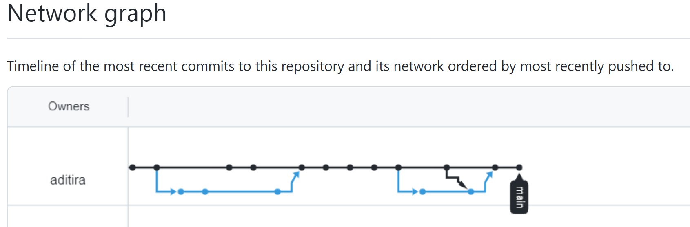

# **Software Engineering - Git and Github Assignment**

## Objectives

- Mengerti penggunaan Git
  - init
  - add
  - commit
  - revert
  - branch
  - solve conflict
- Mengerti penggunaan Github
  - add remote
  - push
  - pull request
  - pull

## Prerequisite

- Sudah install Git di komputer local
- Sudah memiliki account Github
- Sudah mempelajari materi **Terminal**, **VSCode** dan **Version Control System**

## Directions

Di repository ini, buka file bernama `case-study.md`. Disana akan ada case study yang menceritakan bagaimana menggunakan git dan github dalam pekerjaan. Untuk mengerjakan assignment ini, kamu bisa ikuti langkah-langkah berikut:

- Baca setiap scenario dan ikuti setiap tindakan yang dilakukan oleh sudut pandang pertama (**Kita**) dan sudut pandang ke dua (**Bob**).
- Pembuatan `commit message`, `branch` dan `name repositoy github`, `structure folder beserta penamaan file` dan `pull request` **harus sama persis** dengan yang ada di setiap scenario.
- Perjalanan history commit juga harus sesuai dengan scenario.
- Jika ada beberapa yang tidak sesuai dengan scenario, maka akan mengurangi penilaian untuk assignment ini.
- Kerjakan **case study di luar repository ini!**
- Pastikan setelah kamu melakukan push respository ke github, di menu 📈 **Insights** di dalam nya ada menu **Network** akan terlihat seperti ini:

  

  > Pastikan semuanya sama!

## Output

- Link Github Repository _(hasil pengerjaan case study)_

## Output yang harus disubmit ke LMS

- Kamu harus membagikan Github repository yang berisi commit history secara public pada profile github dan pull request sesuai skenario pada file `case-study.md`.
- Link Github repository tersebut yang nantinya akan kamu submit di LMS
