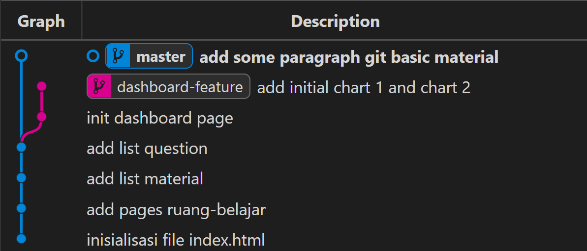
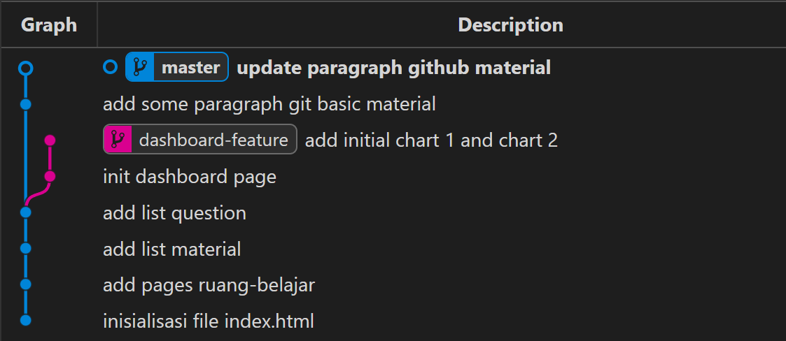
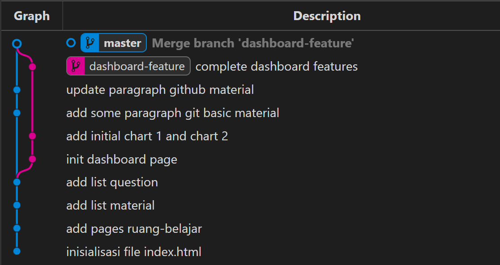
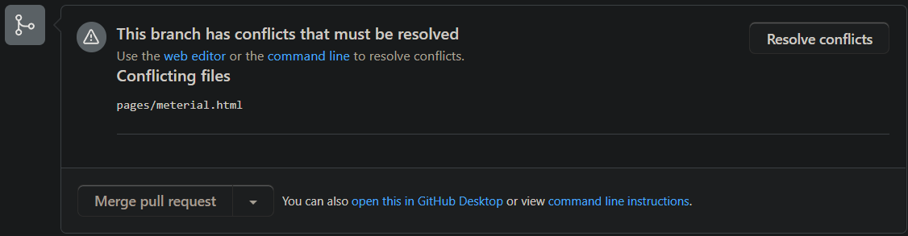
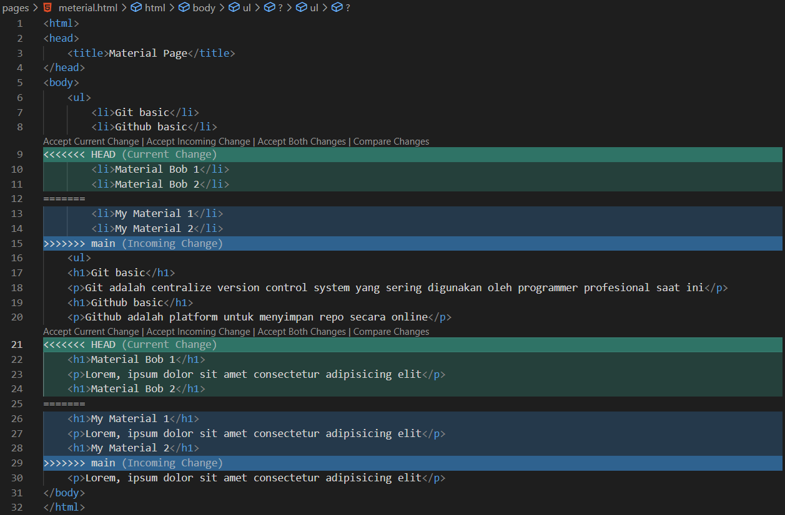
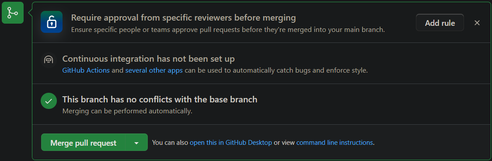
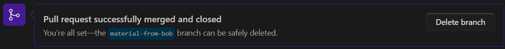
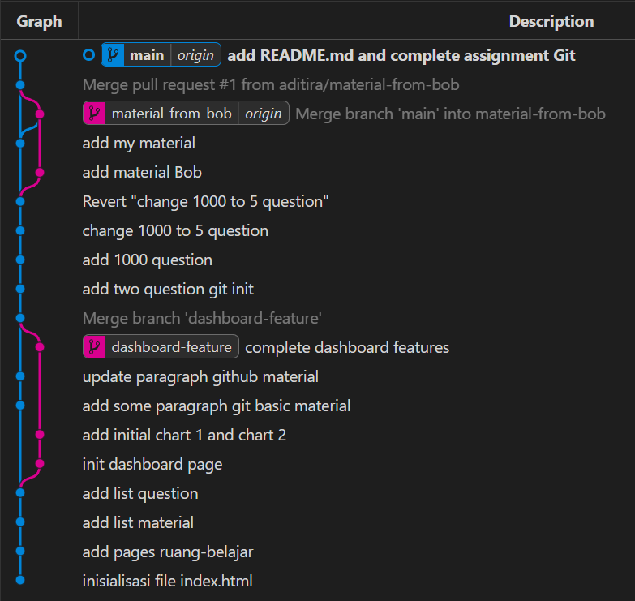

# Case study: Basic use of Git and Github

## Scenario 1

Kita adalah seorang programmer yang diminta oleh Boss untuk membuat aplikasi pembelajaran online bernama **ruang-belajar**. Ini adalah aplikasi yang cukup kompleks sehingga setiap perubahan harus:

- Tercatat dengan baik
- Memiliki backup
- Dan diharapkan bisa rollback ke versi-versi yang lama

Oleh karena itu kita telah memutuskan untuk menggunakan Git untuk mengelola dan mengontrol versi code dari aplikasi tersebut.

---

Kita memulai dengan membuat Git repository di komputer lokal, kemudian kita membuat struktur foldernya sebagai berikut:

```path
📁ruang-belajar
   📁.git
   📄index.html
```

Lalu kita mengisi file `index.html` dengan code:

```html
<html>
<head>
    <title>Ruang Belajar</title>
</head>
<body>
    
</body>
</html>
```

Agar isi dari file `index.html` tidak hilang, maka kita melakukan commit dengan pesan "inisialisasi file index.html"

Kemudian kita membuat file berikutnya yaitu `test.hmtl` dengan isi:

```html
<html>
<head>
    <title>Test Page</title>
</head>
<body>
    
</body>
</html>
```

Namun kita tidak ingin file `test.hmtl` di-commit di Git, karena file itu hanya sample page percobaan pribadi. Akhirnya kita harus mendaftarkannya ke file `.gitignore`.

Lalu kita membuat folder di repository untuk menampung semua halaman dari aplikasi **ruang-belajar** bernama `pages`.

Selanjutnya kita menambahkan beberapa file disana yaitu `meterial.html`, `question.html` dan kita melakukan commit berikutnya dengan pesan "add pages ruang-belajar" commit ini sudah termasuk dengan file `.gitignore`.

Akhirnya strukture file dari aplikasi yang kita buat akan menjadi seperti ini:

```path
📁ruang-belajar
   📁.git
   📁pages
      📄meterial.html
      📄question.html
   📄index.html
   📄test.hmtl
   📄.gitignore
```

Kemudian kita mulai bekerja pada file `material.html` dengan menambahkan beberapa list judul materi pada file tersebut, yaitu:

```html
<html>
<head>
    <title>Material Page</title>
</head>
<body>
    <ul>
        <li>Git basic</li>
        <li>Github basic</li>
    <ul>
</body>
</html>
```

Dan beberapa list pertanyaan pada file `question.html` yaitu:

```html
<html>
<head>
    <title>Question Page</title>
</head>
<body>
    <ul>
        <li>What is Git?</li>
        <li>Why use Git?</li>
    <ul>
</body>
</html>
```

Selanjutnya, kita membuat commit untuk file `material.html` saja dengan pesan "add list material". Dan di commit berikutnya untuk file `question.html` dengan pesan "add list question".

Selanjutnya kita akan mengerjakan ke-2 halaman tersebut dengan target yang sudah ditentukan, dan dirasa itu akan cukup.

Namun, tiba-tiba Boss kita meminta untuk menambahkan halaman dashboard untuk menganalisa jawaban dan nilai dari pengguna aplikasi yang kita buat, tetapi tidak menambah batas waktu pengerjaan.

Sepertinya, hal tersebut tidak akan cukup waktunya jika dikerjakan di jam kerja. Akhirnya, kita putuskan untuk mengerjakan feature dashboard yang diminta di luar jam kerja, malam hari atau weekend. Tetapi feature baru ini tidak ingin sampai mengganggu feature utama yang sedang dikerjakan.

Jadi kita putuskan untuk membuat branch baru bernama `dashboard-feature`.

## Scenario 2

Akhirnya malam hari pun tiba dan jam kerja telah berlalu, namun rasanya kita masih semangat untuk menyelesaikan aplikasi.

Akhirnya kita putuskan untuk membuat feature dashboard yang diminta. Jadi dari branch utama, kita harus pindah ke branch `dashboard-feature` dan menambahkan file `dashboard.html` di folder pages.

Sehingga struktur folder di branch `dashboard-feature` akan terlihat seperti ini:

```path
📁ruang-belajar
   📁.git
   📁pages
      📄meterial.html
      📄question.html
      📄dashboard.html
   📄index.html
   📄test.hmtl
   📄.gitignore
```

Lalu kita tambahkan commit untuk penambahan file tersebut dengan pesan "init dashboard page". Selanjutnya, kita menambahkan file tersebut dengan code:

```html
<html>
<head>
    <title>Dashboard Page</title>
</head>
<body>
    <div>Chart1<div>
    <div>Chart2<div>
</body>
</html>
```

Karena malah sudah larut dan kita butuh istirahat untuk lanjut bekerja di keesokan harinya. Akhirnya sementara kita menyudahi pekerjaan di branch `dashboard-feature` dan beristirahat. Namun sebelum itu, tidak lupa kita melakukan commit dengan pesan "add initial chart 1 and chart 2"

## Scenario 3

Keesokan harinya di jam kerja, kita siap kembali megerjakan feature utama dari aplikasi yang kita buat.

Jadi kita harus kembali ke branch utama yaitu `master`. Lalu kita lanjutkan untuk mengerjakan file `meterial.html` dan menambahkan beberapa paragraph dari file tersebut:

```html
<html>
<head>
    <title>Material Page</title>
</head>
<body>
    <ul>
        <li>Git basic</li>
        <li>Github basic</li>
    <ul>
    <h1>Git basic</h1>
    <p>Git adalah centralize version control system yang sering digunakan oleh programmer profesional saat ini</p>
</body>
</html>
```

Lalu kita lakukan commit kembali dengan pesan "add some paragraph git basic material"



Sekarang terlihat bahwa branch utama terisolasi dari perubahan kita tadi malam di branch `dashboard-feature`.

Selanjutnya kita menambahkan paragraph untuk materi di list selanjutnya pada file yang sama:

```html
<html>
<head>
    <title>Material Page</title>
</head>
<body>
    <ul>
        <li>Git basic</li>
        <li>Github basic</li>
    <ul>
    <h1>Git basic</h1>
    <p>Git adalah centralize version control system yang sering digunakan oleh programmer profesional saat ini</p>
    <h1>Github basic</h1>
    <p>Github adalah platform untuk menyimpan repo secara online</p>
</body>
</html>
```

Dan melakukan commit kembali dengan pesan "update paragraph github material"



Semua branch berjalan _independent_, tidak saling berkaitan selama _progress_ berjalan.

## Scenario 4

Malam hari nya, kita siap untuk menyelesaikan branch `dashboard-feature`. Jadi dari branch `master` kita pindah ke branch tersebut.

Lalu kita menambahkan code di file `dashborad.html` untuk menyelesaikannya:

```html
<html>
<head>
    <title>Dashboard Page</title>
</head>
<body>
    <div>
        <canvas id="chart1"></canvas>
    <div>
    <div>
        <canvas id="chart2"></canvas>
    <div>
</body>
</html>
```

Karena pekerjaan di branch tersebut telah selesai, maka kita melakukan penggabungan dari branch `master` ke branch `dashboard-feature`



Setelah branch digabungkan, kita siap untuk mengerjakan file selanjutnya yaitu file `question.html`. di sini kita tambahkan pertanyaannya:

```html
<html>
<head>
    <title>Question Page</title>
</head>
<body>
    <ul>
        <li>What is Git?</li>
        <li>Why use Git?</li>
    <ul>
    <h1>What is Git</h1>
    <p>Apa itu git init?</p>
    <p>Kapan kita mengguanakn git init?</p>
</body>
</html>
```

Setelah menambahkan pertanyaan tersebut, kita lakukan commit dengan pesan "add two question git init"

Di commit kita selanjutnya menambahkan total 1.000 soal:

```html
<html>
<head>
    <title>Question Page</title>
</head>
<body>
    <ul>
        <li>What is Git?</li>
        <li>Why use Git?</li>
        <li>Soal 4</li>
        <li>Soal 5</li>
        <li>Soal 6</li>
        ...
        ...
        ...
        <li>Soal 1000</li>
    <ul>
    <h1>What is Git</h1>
    <p>Apa itu git init?</p>
    <p>Kapan kita mengguanakn git init?</p>
    ...
    ...
    ...
    <h1>Soal 1000</h1>
</body>
</html>
```

Tidak lupa melakukan commit dengan pesan "add 1000 question". Namun, baru saja kita melakukan commit, Tiba-tiba boss kita diminta untuk tidak membuat soal sebanyak itu. Cukup dengan 5 soal saja. Akhirnya, di commit berikutnya kita dan **menghapus semua soal** tersebut dan menggantinya dengan 5 soal:

```html
<html>
<head>
    <title>Question Page</title>
</head>
<body>
    <ul>
        <li>What is Git?</li>
        <li>Why use Git?</li>
        <li>Soal 4</li>
        <li>Soal 5</li>
    <ul>
    <h1>What is Git</h1>
    <p>Apa itu git init?</p>
    <p>Kapan kita mengguanakn git init?</p>
    <h1>Soal 5</h1>
</body>
</html>
```

Tidak lupa melakukan commit dengan pesan "change 1000 to 5 question". Tapi seiring aplikasi ini dipresentasikan, ternyata memang aplikasi ini butuh soal sebanyak 1000. Jadi kita diminta untuk menulis kembali soal yang berjumlah 1000 yang telah kita buat sebelumnya dengan cepat.

Jika kita menulis ulang secara manual, tentunya ini akan membutuhkan waktu yang cukup lama. Untungnya kita menggunakan Git untuk menyimpan semua history dari perubahan yang dibuat. Jadi kita melakukan **revert** ke commit tempat kita menambahkan 1000 soal.


Setelah melakukan revert, maka soal kita sudah _rollback_ sehingga tidak perlu menulis ulang sebanyak 1000 soal.

## Scenario 5

Setelah mengerjakan cukup banyak feature, kita sadar bahwa halaman materi di file `meterial.html` masih cukup banyak yang harus dikerjakan. Namun deadline aplikasi ini untuk release sudah semakin dekat.

Jadi untuk mempercepat progress pengerjaan, maka Boss kita memberi programmer tambahan bernama **Bob** untuk membantu menyelesaikan aplikasi ini.

Agar kita bisa berkolaborasi dengan **Bob** maka kita harus membagikan repository ini ke padanya. Namun akan sangat _primitif_ jika kita membagikannya menggunakan _flashdisk_ 😅. Mungkin itu bisa, tapi akan sangat sulit ketika kita ingin melakukan sinkronisasi perubahan kita dengan perubahan **Bob**.

Maka dari itu, kita akan membuat repository bersama yang juga bisa diakses oleh **Bob** di **Github** profile kita bernama **ruang-belajar** yang bisa diakses _public_.

Setelah membuatnya, kita melakukan push repository yang ada di local kita, ke repository Github yang baru saja dibuat dengan branch utama yaitu `main`.

Setelah itu, kita meminta **Bob** untuk melakukan cloning repository tersebut dan membuat branch sendiri dan bekerja disana, juga melakukan push perubahan rutin dengan commit yang jelas, agar mudah untuk di maintain.

## Scenario 6

Sekarang bayangkan sudut pandang kita sebagai **Bob**, kita akan melakukan cloning dan membuat branch baru bernama `material-from-bob`. Lalu kita pindah ke branch tersebut dan menambahkan beberapa materi pada file `material.html` yaitu:

```html
<html>
<head>
    <title>Material Page</title>
</head>
<body>
    <ul>
        <li>Git basic</li>
        <li>Github basic</li>
        <li>Material Bob 1</li>
        <li>Material Bob 2</li>
    <ul>
    <h1>Git basic</h1>
    <p>Git adalah centralize version control system yang sering digunakan oleh programmer profesional saat ini</p>
    <h1>Github basic</h1>
    <p>Github adalah platform untuk menyimpan repo secara online</p>
    <h1>Material Bob 1</h1>
    <p>Lorem, ipsum dolor sit amet consectetur adipisicing elit</p>
    <h1>Material Bob 2</h1>
    <p>Lorem, ipsum dolor sit amet consectetur adipisicing elit</p>
</body>
</html>
```

Dan melakukan commit dengan pesan "add material Bob" dan tidak lupa melakukan push beserta membuat Pull Request dari perubahan yang telah dilakukan, dengan judul PR: **doc: Material from Bob**.

## Scenario 7

Kembali lagi ke sudut pandang kita yang akan mengerjakan materi di branch `main`. Kita menambahkan konten di file `material.html` yaitu:

```html
<html>
<head>
    <title>Material Page</title>
</head>
<body>
    <ul>
        <li>Git basic</li>
        <li>Github basic</li>
        <li>My Material 1</li>
        <li>My Material 2</li>
    <ul>
    <h1>Git basic</h1>
    <p>Git adalah centralize version control system yang sering digunakan oleh programmer profesional saat ini</p>
    <h1>Github basic</h1>
    <p>Github adalah platform untuk menyimpan repo secara online</p>
    <h1>My Material 1</h1>
    <p>Lorem, ipsum dolor sit amet consectetur adipisicing elit</p>
    <h1>My Material 2</h1>
    <p>Lorem, ipsum dolor sit amet consectetur adipisicing elit</p>
</body>
</html>
```

Dan melakukan commit dengan pesan "add my material" dan tidak lupa melakukan push ke branch main di repo github yang sudah kita buat.

## Scenario 8

Setelah kita berkolaborasi dengan branch yang berbeda, **Bob** mengkonfirmasi bahwa materi yang sudah dibuatnya telah selesai dan siap untuk digabungkan dengan perubahan yang kita buat. Namun setelah kita check PR nya, ternyata terjadi conflict antara branch `main` dengan `material-from-bob`.



Jadi kita bisa pindah ke branch `material-from-bob` dan melakukan merge dari sana ke branch `main` untuk menyelesaikan conflict yang terjadi.



Terlihat bahwa, ada beberapa conflict yang terjadi. Kita harus memilih kedua perubahan tersebut karena kita melakukan perubahan pada file yang sama, untuk berkolaborasi.

Setelah memilih kedua perubahan, lalu kita lakukan commit dengan pesan "Merge branch 'main' into material-from-bob" dan tidak lupa melakukan push.

Maka sekarang terlihat bahwa PR **Bob** sudah tidak terjadi conflict dan sial digabungkan dengan menekan tombol "Merge pull request".



Setelah dilakukan penggabungan branch, maka kita bisa menghapus branch `material-from-bob` untuk menandakan bahwa pekerjaan di branch tersebut telah selesai.



Jika kita kembali ke branch `main` di _local repository_ kita, maka penggabungan belum dilakukan. Mengapa demikian? Karena penggabungan dilakukan oleh Pull Request di Github.

Jadi untuk melakukan update di _local repository_ kita, maka kita harus melakuakan penarikan _(**pull**)_ perubahan yang ada di remote.

Akhirnya pekerjaan membuat aplikasi **ruang-belajar** telah selesai, untuk commit terakhir, kita menambahkan file `README.md` di repository nya dengan isi:

```md
# Ruang Belajar

Contributor:

- `<yourname> - <id>`
- Bob
```

Dan melakukan commit dengan pesan "add README.md and complete assignment Git" juga melakukan **Push** ke repository Github kita. Akhirnya, aplikasi kita dinobatkan sebagai aplikasi pembelajaran terbaik di **Indonesia** 😄 dan tentunya kita bisa mengembangkan aplikasi ini sampai ke manca negara. 🕺

Last Graph commit:


